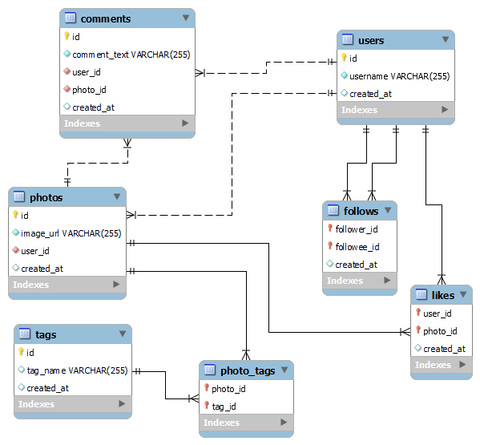

# 

<table>
  <tr>
    <td><h1>✨ Instagram database clone Project ✨ </h1></td>
    <td></td>
  </tr>
</table>

### Languages & Tools I Used 

### Introduction 

Hello! In this repository, I am sharing the MySQL project that I completed as part of 'The Ultimate MySQL Bootcamp: Go from SQL Beginner to Expert' course by Colt Steele. If you're interested, you can access the course through this link. https://www.udemy.com/course/the-ultimate-mysql-bootcamp-go-from-sql-beginner-to-expert/?couponCode=KEEPLEARNING. 

In this project, I first created a database schema, which you can see in the image below:

As shown, there are 7 different tables and connections."

You can find the SQL file I used to create the database under the name 'ins.sql'. Additionally, in the 'sorgular.sql' file, you can find various queries. These queries and their purposes are as follows:

### Queries 
##### Query 1: Finding the oldest user.

##### Query 2: Identifying the top 3 most popular days for new user registrations—the days when the most users signed up in the past. 
  This query provides insight into which days might be most effective for targeted advertising with a limited budget.
  
##### Query 3: Identifying inactive users who have not shared any photos. 
  This query helps in detecting overlooked accounts or customers that may require attention."

##### Query 4: Finding the most liked/popular post and its owner. 
  Queries like this can provide valuable data for customer loyalty programs.

##### Query 5: Average number of photos per user. 
  Queries like this can provide various insights about the users of the system and help gather general usage data.

##### Query 6: Detecting bot accounts that like all photos. 
  Queries like this can help identify accounts that may affect the authenticity of your system and create undesirable situations.

